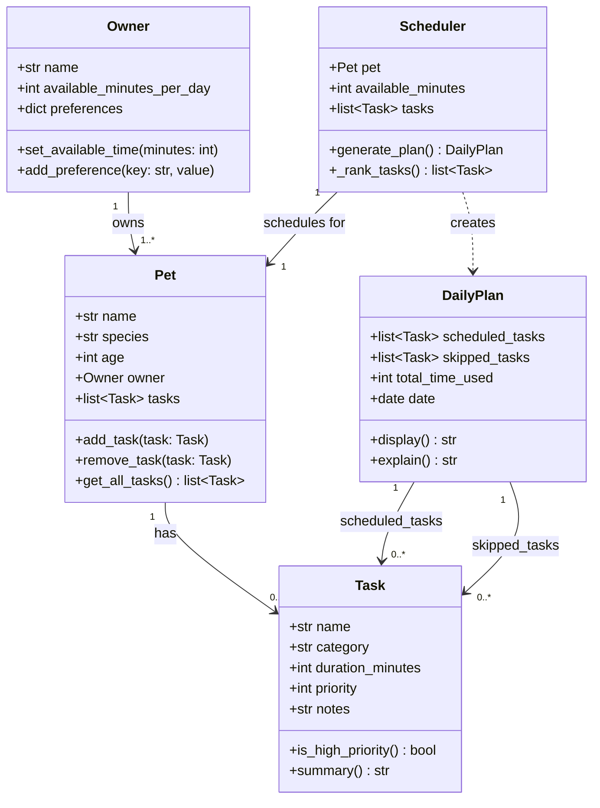

# PawPal+ UML Class Diagram

```mermaid
classDiagram
    class Owner {
        +str name
        +int available_minutes_per_day
        +dict preferences
        +set_available_time(minutes: int)
        +add_preference(key: str, value)
    }

    class Pet {
        +str name
        +str species
        +int age
        +Owner owner
        +list~Task~ tasks
        +add_task(task: Task)
        +remove_task(task: Task)
        +get_all_tasks() list~Task~
    }

    class Task {
        +str name
        +str category
        +int duration_minutes
        +int priority
        +str notes
        +is_high_priority() bool
        +summary() str
    }

    class Scheduler {
        +Pet pet
        +int available_minutes
        +list~Task~ tasks
        +generate_plan() DailyPlan
        +_rank_tasks() list~Task~
    }

    class DailyPlan {
        +list~Task~ scheduled_tasks
        +list~Task~ skipped_tasks
        +int total_time_used
        +date date
        +display() str
        +explain() str
    }

    Owner "1" --> "1..*" Pet : owns
    Pet "1" --> "0..*" Task : has
    Scheduler "1" --> "1" Pet : schedules for
    Scheduler ..> DailyPlan : creates
    DailyPlan "1" --> "0..*" Task : scheduled_tasks
    DailyPlan "1" --> "0..*" Task : skipped_tasks
```
